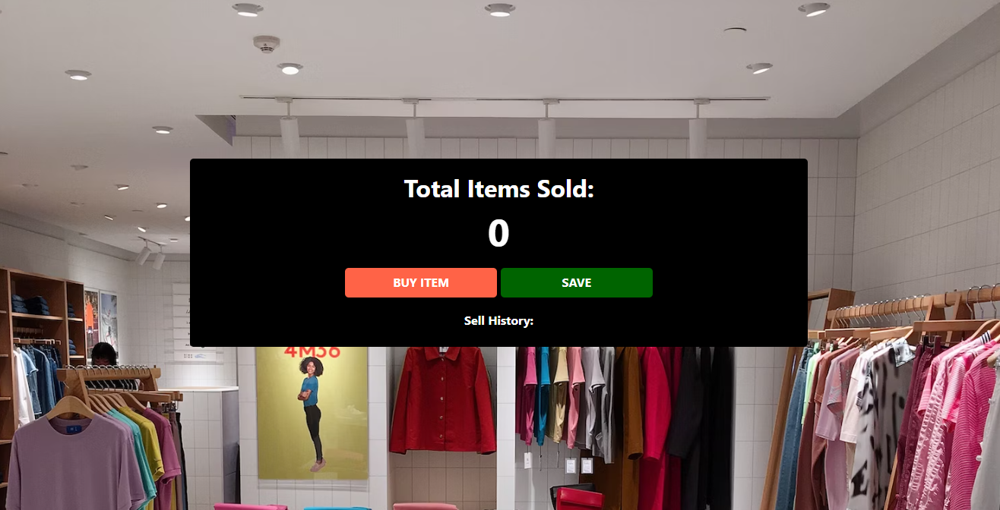
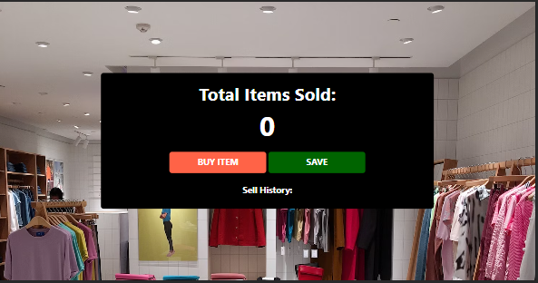

# Project: Counter

## Description:
This is simple web application project which is used to count the number, that number here is counting total items to sold and also keep track of previous selling history.

## Features:
- counting
- Keep track of History

## Languages:
- HTML
- CSS
- JavaScript

## Output:

Happy Coding!